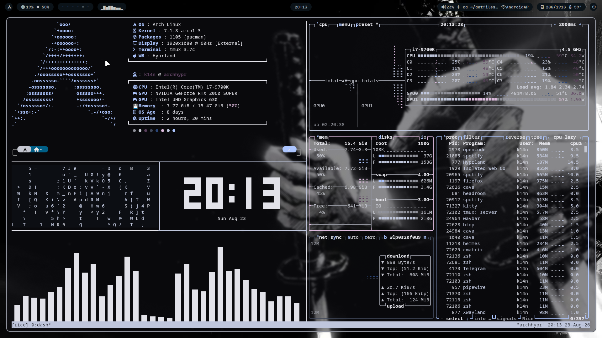

# 🐧 Arch Linux + Hyprland Dotfiles

My personal **Arch Linux + Hyprland** dotfiles.

A clean and minimal desktop setup featuring **Hyprland, Waybar, Kitty, Neovim, Rofi, Mako, Cava**, and dynamic colors powered by **Matugen / Pywal**.

> [!WARNING]
> These are my personal configuration files.
> The installer automatically creates backups before replacing existing configs, but reviewing the configuration before installation is still recommended.

---

## ✨ Components

| Component | Application |
|---|---|
| 🪟 Window Manager | Hyprland |
| 📊 Bar | Waybar |
| 💻 Terminal | Kitty |
| ✏️ Editor | Neovim |
| 🚀 Launcher | Rofi |
| 🔔 Notifications | Mako |
| 🎵 Audio Visualizer | Cava |
| 🎨 Dynamic Colors | Matugen / Pywal |

---

---## 📸 Screenshot



<p align="center">
  <b>Arch Linux • Hyprland • Waybar • Kitty • btop</b>
</p>

## 📁 Structure

```text
dotfiles/
├── cava/
├── hypr/
├── kitty/
├── mako/
├── nvim/
├── rofi/
├── waybar/
└── install.sh
```

Each folder corresponds to a configuration inside:

```text
~/.config/
```

---

# 🚀 Installation

## Automatic Installation

Clone the repository:

```bash
git clone https://github.com/kianlabs/dotfiles.git ~/dotfiles
cd ~/dotfiles
```

Make the installer executable:

```bash
chmod +x install.sh
```

Run:

```bash
./install.sh
```

The installer provides an interactive menu:

```text
1) Full installation
2) Install one component
3) Install dependencies only
4) Check dependencies
5) Restore backup
0) Exit
```

### Full Installation

Option `1` installs the required packages and copies all available dotfiles.

Existing configurations are backed up automatically before being replaced.

Backups are stored in:

```text
~/.config-backups/
```

For example:

```text
~/.config-backups/dotfiles-20260823-193606/
```

If a backup operation fails, installation of that component is aborted before the existing configuration is removed.

---

## 🧩 Install Individual Components

You don't need to install the entire setup.

Run:

```bash
./install.sh
```

Then choose:

```text
2) Install one component
```

Available components:

```text
1) Hyprland
2) Waybar
3) Kitty
4) Neovim
5) Rofi
6) Mako
7) Cava
```

This is useful if you only want a specific part of the rice.

---

## ♻️ Restore Backup

The installer can restore configurations created by previous installations.

Run:

```bash
./install.sh
```

Choose:

```text
5) Restore backup
```

Then select the backup you want to restore.

Backups are located at:

```text
~/.config-backups/
```

---

# 📦 Requirements

This setup is primarily designed for:

```text
Arch Linux + Hyprland
```

The installer handles the main dependencies automatically.

Core applications include:

```text
hyprland
waybar
kitty
neovim
rofi
mako
cava
thunar
```

Additional utilities used by the configuration include:

```text
wl-clipboard
cliphist
wireplumber
brightnessctl
hypridle
hyprlock
hyprshot
NetworkManager
bluez
lm_sensors
libnotify
btop
```

Some optional features also use:

```text
Matugen
Pywal
Awww
Quickshell
```

A **Nerd Font** is recommended for proper icon rendering.

---

# 🎨 Dynamic Colors

The setup supports dynamic color generation using:

- Matugen
- Pywal

Generated palette/cache files are intentionally not stored in this repository because they are machine and wallpaper specific.

If a Pywal palette has not been generated yet, run:

```bash
wal -i /path/to/wallpaper.jpg
```

Some applications can then follow the generated color palette.

---

# ⌨️ Keybinds

| Keybind | Action |
|---|---|
| `SUPER + T` | Open Kitty |
| `SUPER + A` | Open Rofi |
| `SUPER + E` | Open Thunar |
| `SUPER + Q` | Close window |
| `SUPER + F` | Toggle floating |
| `SUPER + V` | Clipboard history |
| `SUPER + C` | Open Cava |
| `SUPER + grave` | Open btop |
| `SUPER + 1..0` | Switch workspace |
| `SUPER + SHIFT + 1..0` | Move window to workspace |
| `SUPER + ALT + ← / →` | Previous / next workspace |
| `SUPER + S` | Toggle special workspace |
| `Print` | Screenshot monitor |
| `SHIFT + Print` | Screenshot region |
| `SUPER + Print` | Screenshot window |

The complete configuration is available at:

```text
hypr/configs/keybinds.lua
```

---

# ✏️ Neovim

The included Neovim configuration uses **lazy.nvim**.

Features include:

- LSP support
- Treesitter
- Telescope
- Neo-tree
- Autocompletion
- Git integration
- Integrated terminal
- Matugen / Base16 colors
- Catppuccin Mocha fallback

Launch Neovim with:

```bash
nvim
```

Plugins will be handled by the Neovim configuration.

---

# 📊 Waybar

Waybar provides information such as:

- Workspaces
- CPU usage
- Memory usage
- Storage
- CPU temperature
- Audio volume
- Bluetooth
- Network
- Active window
- Clock
- Cava visualizer

Configuration:

```text
waybar/config.jsonc
waybar/style.css
```

---

# 🎵 Cava

Cava is used as the audio visualizer.

The repository includes configuration for:

```text
cava/config
cava/waybar.conf
```

Waybar integration is handled through:

```text
~/.config/waybar/scripts/cava.sh
```

---

# 🔔 Notifications

Mako is used as the Wayland notification daemon.

Configuration:

```text
mako/config
```

Test notifications with:

```bash
notify-send "Hello" "Notifications are working!"
```

---

# 🛡️ Safety

The installer is designed to protect existing configurations.

Before replacing a component it performs:

```text
Existing config
      ↓
Create backup
      ↓
Verify backup succeeded
      ↓
Remove old config
      ↓
Install new config
```

If installation fails after the previous config was removed, the installer attempts to restore the backup automatically.

Still, never blindly delete your entire configuration directory:

```bash
rm -rf ~/.config
```

---

# 🛠️ Manual Installation

If you don't want to use the installer, individual configs can be installed manually.

Example for Waybar:

```bash
mv ~/.config/waybar ~/.config/waybar.backup 2>/dev/null || true
cp -a ~/dotfiles/waybar ~/.config/waybar
```

Example for Kitty:

```bash
mv ~/.config/kitty ~/.config/kitty.backup 2>/dev/null || true
cp -a ~/dotfiles/kitty ~/.config/kitty
```

The same approach can be used for other components.

---

# 🔄 Updating

Update your local clone:

```bash
cd ~/dotfiles
git pull
```

Check modifications before updating:

```bash
git status
```

If you've modified the configs locally, review the changes before pulling.

---

# 🤝 Contributing

This repository contains my personal configuration, but suggestions and improvements are welcome.

Feel free to open an issue or submit a pull request.

---

# ⭐ Support

If you find this setup useful, consider giving the repository a star.

---

# 📜 License

No license has been added yet.
